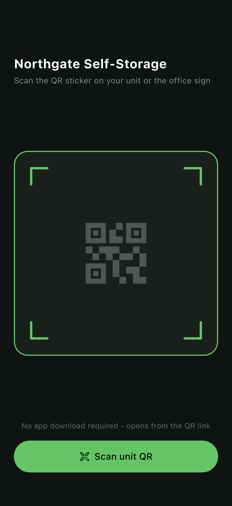
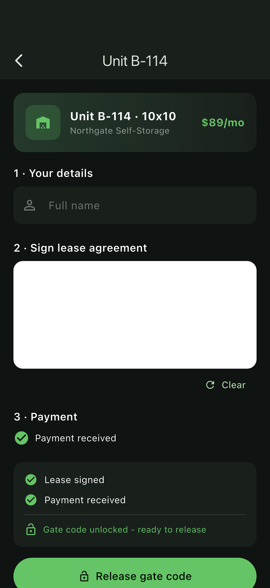
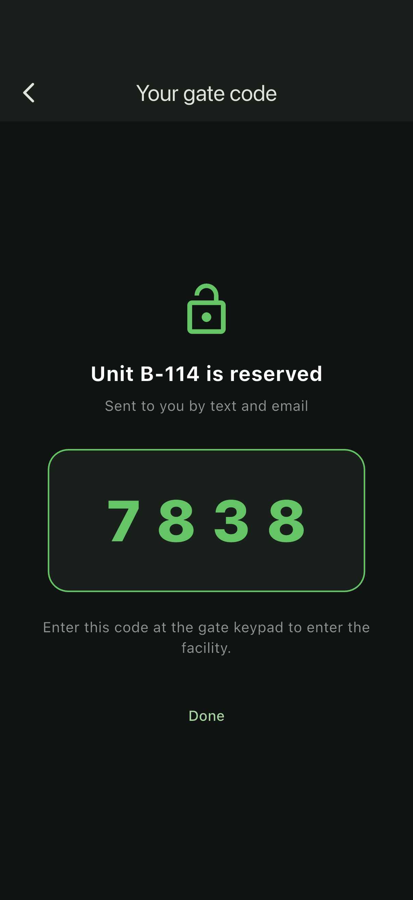

# flutter_storage_gate_access

A Flutter + Riverpod POC for a **self-storage QR check-in** flow: a customer scans a QR sticker on a unit, completes their details, signs the lease, pays, and only then is a **gate code** generated and released - never before.

Models the exact requirement: gate code stays hidden until the lease is signed, payment is received, and (optionally) admin approval is complete.

## Screenshots

| QR scan | Reservation + lease + payment | Gate code released |
| --- | --- | --- |
|  |  |  |

## What it shows

- **QR entry, no app download** - a scan opens straight into the reservation flow (the screen is wired for `mobile_scanner` in a real build; the POC simulates a decode so it runs camera-free on a simulator).
- **Lease e-signature** - a plugin-free signature pad (`GestureDetector` + `CustomPainter`) captures the stroke.
- **Payment** - first-month payment step (mocked; drop-in point for Stripe / Apple Pay).
- **Gated gate-code release** - a `Reservation` state machine in Riverpod exposes `canReleaseGateCode`, which is `leaseSigned && paid && (!adminApprovalRequired || adminApproved)`. The "Release gate code" button is disabled and the code is hidden until that is true. On release a code is generated and shown as "sent by text and email".

## Architecture

- **Flutter** + **Riverpod** (`Notifier` / `NotifierProvider`)
- `lib/src/reservation_provider.dart` - reservation state machine + gating rules
- `lib/src/signature_pad.dart` - lease e-signature capture
- `lib/src/reservation_screen.dart` - details, lease, payment, live gate status
- `lib/src/gate_code_screen.dart` - released code

## Run

```bash
flutter pub get
flutter run -d ios
```

See [`FLOW.md`](FLOW.md) for the screenshot-capture flow.
